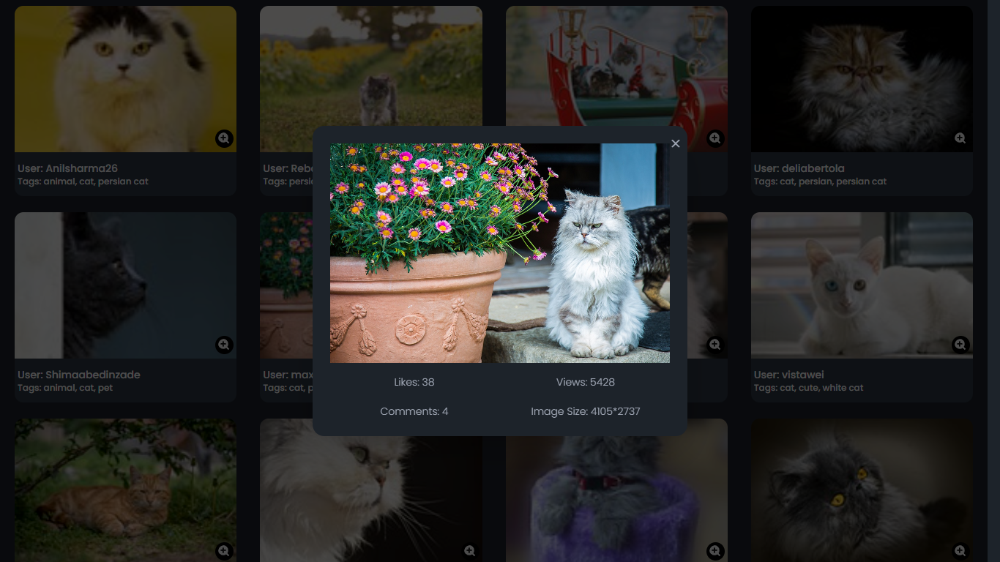

# Task

Task is a React application enhanced with Tailwind CSS and the Daisy UI plugin, designed to provide a seamless experience for querying the Pixabay API and displaying results in a modal format. This project aims to streamline the process of searching for images by integrating powerful technologies and a user-friendly interface.

### Frameworks I worked with

This app is built on seven frameworks that are shown below.

- [![React][React]][ReactUrl]
- [![TailwindCss][Tailwind]][TailwindUrl]

### Live Demonstration

Task is live here [Project](https://task-mu-coral.vercel.app/)

Here are the screenshots of the Fudo Website

**Home Page**


---

**Searched Images**


---

**Modal**


## Getting Started

To get started you can simply clone this `Task` repository and install the dependencies.

Clone the `Task` repository using git:

```bash
git clone https://github.com/faiyaj7/Task
cd Task
```

Install dependencies with this command:

```bash
npm install
```

Run the application with this command:

```bash
npm start
```

[React]: https://img.shields.io/badge/React-20232A?style=for-the-badge&logo=react&logoColor=61DAFB
[ReactUrl]: https://reactjs.org/
[Tailwind]: https://img.shields.io/badge/tailwindcss-%2338B2AC.svg?style=for-the-badge&logo=tailwind-css&logoColor=white
[TailwindUrl]: https://tailwindcss.com
